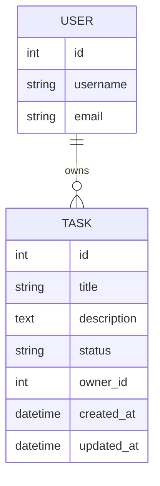

# Django Task Manager

A simple Django web application for managing project tasks.
The project includes both Bootstrap-based UI pages and RESTful API endpoints built with Django REST Framework.

## Project Goal

The goal of this project is to allow users to manage tasks in a project environment.

Users can:

* Log in using Django authentication
* View all tasks created by all users
* Search tasks by title or description
* View task details
* Create their own tasks
* Update and delete only their own tasks
* Use REST API endpoints for task list/create and task detail/update/delete

## Technologies Used

* Python
* Django
* Django REST Framework
* SQLite
* Bootstrap
* JavaScript / AJAX
* HTML / CSS

## Main Features

### Web UI

The project includes Bootstrap-based pages for:

* Login
* Task list
* Task detail
* Task creation
* Task update
* Task deletion confirmation

### REST API

The project includes RESTful API endpoints using Django REST Framework.

### AJAX Search

The task list page uses JavaScript `fetch()` to request task data from the API without fully reloading the page.

The search input sends a request to the API and updates the task list dynamically.

### Authentication and Permissions

The project uses Django's built-in `User` model.

All authenticated users can view all tasks.

Only the owner of a task can update or delete that task.

Unauthenticated users are redirected to the login page.

## Database Design / ER Diagram



## Task Model

Each task contains:

* Title
* Description
* Status
* Owner
* Created date
* Updated date

The `owner` field is a foreign key to Django's built-in `User` model.

## Web Routes

| Route                 | Description            |
| --------------------- | ---------------------- |
| `/`                   | Redirects to task list |
| `/accounts/login/`    | Login page             |
| `/accounts/logout/`   | Logout                 |
| `/tasks/`             | Task list and search   |
| `/tasks/create/`      | Create a new task      |
| `/tasks/<id>/`        | Task detail            |
| `/tasks/<id>/edit/`   | Edit a task            |
| `/tasks/<id>/delete/` | Delete confirmation    |

## API Routes

| Method      | Endpoint           | Description           |
| ----------- | ------------------ | --------------------- |
| `GET`       | `/api/tasks/`      | List all tasks        |
| `POST`      | `/api/tasks/`      | Create a new task     |
| `GET`       | `/api/tasks/<id>/` | Retrieve task details |
| `PUT/PATCH` | `/api/tasks/<id>/` | Update a task         |
| `DELETE`    | `/api/tasks/<id>/` | Delete a task         |

## Search API

The API supports searching tasks by title or description:

```text
/api/tasks/?q=keyword
```

The older `search` query parameter is also supported:

```text
/api/tasks/?search=keyword
```

## Permissions

| Action            | Permission      |
| ----------------- | --------------- |
| View task list    | Logged-in users |
| View task detail  | Logged-in users |
| Create task       | Logged-in users |
| Edit task         | Task owner only |
| Delete task       | Task owner only |
| API list/retrieve | Logged-in users |
| API create        | Logged-in users |
| API update/delete | Task owner only |

## Local Setup

Clone the repository:

```bash
git clone https://github.com/iqan1996/django-task-manager
cd django-task-manager
```

Create and activate a virtual environment:

```bash
python3 -m venv venv
source venv/bin/activate
```

Install dependencies:

```bash
pip install -r requirements.txt
```

Run migrations:

```bash
python manage.py migrate
```

Create a superuser:

```bash
python manage.py createsuperuser
```

Run the development server:

```bash
python manage.py runserver
```

Open the project in the browser:

```text
http://127.0.0.1:8000/
```

## Static Files

For local development with `DEBUG=True`, Django serves static files automatically.

For deployment, collect static files with:

```bash
python manage.py collectstatic
```

## Security Notes

* Task update and delete operations are protected by ownership checks.
* The API uses custom object-level permissions to prevent non-owners from modifying other users' tasks.
* Search is implemented using Django ORM filters, not raw SQL.
* Template output is escaped by default.
* JavaScript rendering uses `textContent` for user-provided task data to reduce XSS risk.

## Deployment

The project has been deployed on PythonAnywhere for demonstration.

Live demo:

```text
https://nobody1996.pythonanywhere.com/
```

## Project Status

Core requirements completed:

* Task model
* ER diagram
* Bootstrap UI pages
* Login/logout
* Task CRUD
* REST API list/create endpoint
* REST API detail/update/delete endpoint
* Search by title and description
* AJAX search enhancement
* Ownership-based permissions
* PythonAnywhere deployment
* Basic automated permission tests


This README was prepared with AI assistance and reviewed by the project author.